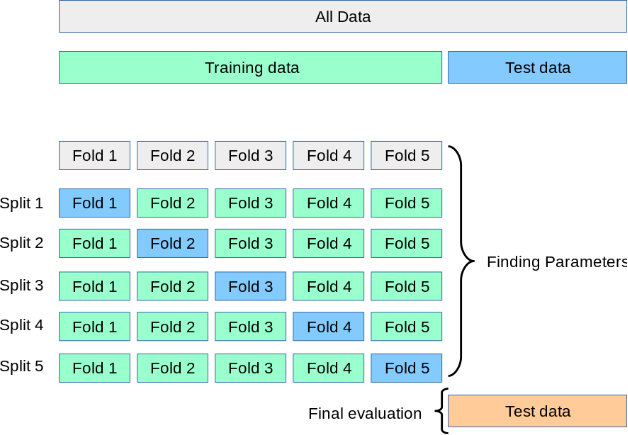
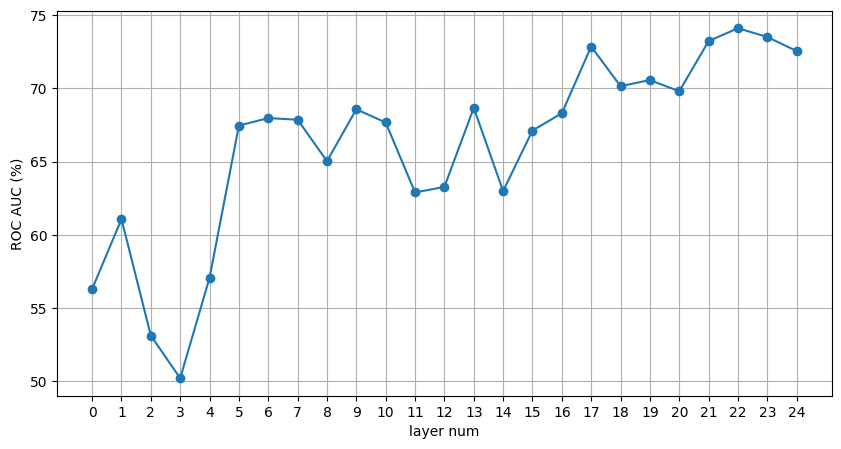

**1. Reproducibility instruction.** 

Open the terminal and run:
```
git clone https://github.com/MaxTimoshkin/SMILES-2026-Hallucination-Detection.git
cd SMILES-2026-Hallucination-Detection
pip install -r requirements.txt
python solution.py
```

**2. Output files.**

1. `results.json` - produced by the official solution.py
1. `predictions.csv` - produced by the official solution.py

**3. Final solution description**

**3.1. K-Folds cross validation**

I modified the `splitting.py` file to implement K-Folds cross-validation in the `split_data` function instead of the usual train/validation/test splitting.



First, I set aside the test data, then divided the remaining sample into several splits by train/validation.

**3.2. Selecting the best layers and forming a single feature vector**

I modified `aggregation.py` file to change the aggregation strategy.

To find the best representations for classifying LLM hallucinations, I repeatedly trained a probe on the latent representation of the last token for each LLM layer. For each LLM layer, I obtained different ROCAUC values ​​on the validation set after training, averaged using K-Folds cross-validation (5 splits). Below is a plot of ROCAUC (%) versus LLM layer number.



From this graph I selected the five best layers for this model:\
`best_layers = [17, 21, 22, 23, 24]`

**The final feature vector** is a concatenation of two components:

1) Normalized concatenation of the hidden states of the last token of the best layers\
`layers = torch.nn.functional.normalize(hs, dim=0).flatten()`

3) Maximum over the best layers\
`m, _ = torch.max(hs, dim=0)`\
Idea: to isolate the strongest signal from the selected layers, which can help identify hallucinations.

**3.3. Geometric features**

I modified `aggregation.py` file to change the feature extraction.

As geometric features, I tried the mean and standard deviation of the following features:
1) last layer norm.
2) cos similarity beetween two last layers.
3) diff beetween two last layers.

I tried geometric features above, but they reduced the resulting metrics, so I didn't use them in the final solution.

**3.4. Neural Network and Training**

I modified `probe.py` file to change the neural network architecture and training parameters.

1) Added more layers and neurons to the neural network\. This allows the model to extract complex hallucination patterns from LLM hidden states.
2) Added Dropout and BatchNorm\. This improves robustness and generalization ability, reducing overfitting with a small training set.
3) More training steps (200 -> 300)\. This allows the model to better learn complex LLM hallucination patterns.
